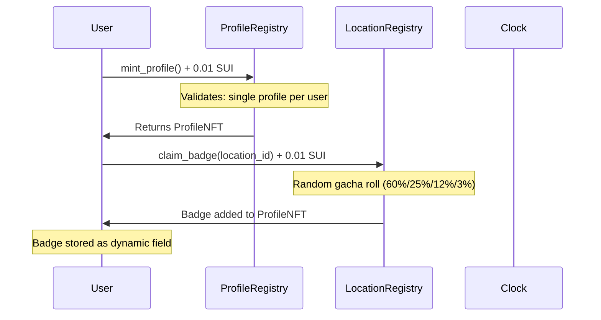
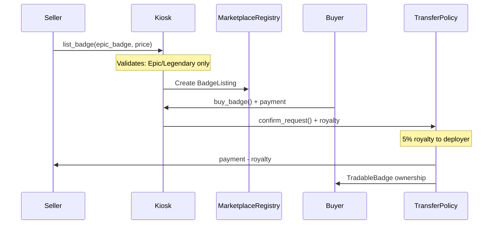
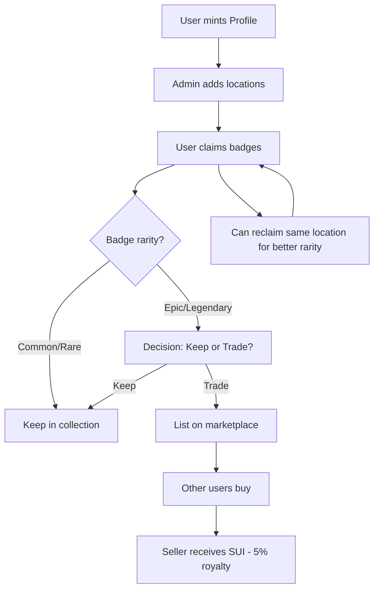
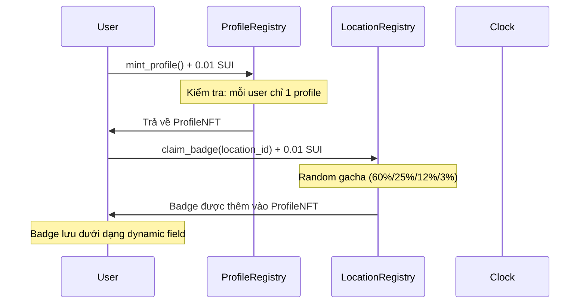
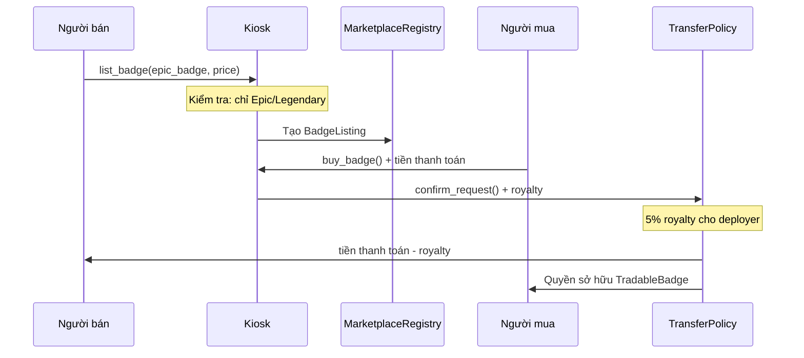
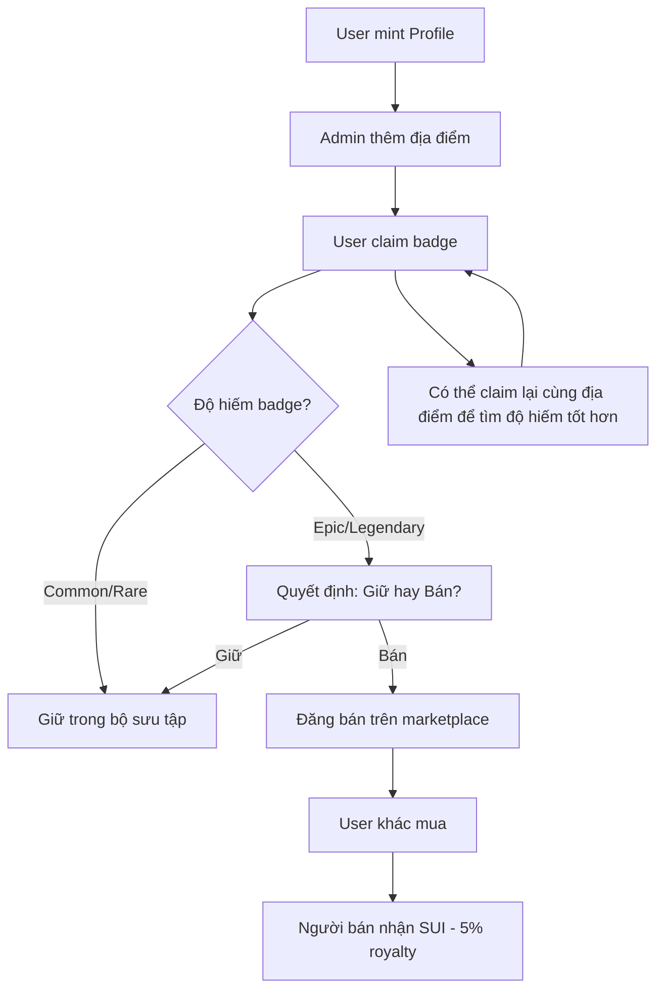

# 🎫 NFT Check-in System on Sui Blockchain

**[English](#english)** | **[Tiếng Việt](#vietnamese)**

---

<a name="english"></a>

# 🌍 ENGLISH VERSION

### 📖 Overview

**NFT Check-in System** is a decentralized application built on Sui blockchain that allows users to collect location-based NFT badges through a check-in mechanism. The system features a unique gacha system for badge rarity and includes a marketplace for trading rare badges.

### ✨ Key Features

#### 1️⃣ **Profile NFT System** (`nft_checkin::profiles`)

- **One Profile Per User**: Each user can mint only one unique Profile NFT
- **Profile Information**:
  - Name, bio, avatar URL
  - Social media links
  - Country
  - Badge collection tracking
  - Creation timestamp
- **Mint Fee**: 0.01 SUI per profile
- **Non-transferable**: Profile NFTs are soul-bound to the owner

#### 2️⃣ **Location Badge System**

- **Admin-managed Locations**: Deployer adds check-in locations with GPS coordinates
- **Badge Template**: Each location has 4 rarity-specific images
  - Common (60% drop rate)
  - Rare (25% drop rate)
  - Epic (12% drop rate)
  - Legendary (3% drop rate)
- **Gacha Mechanism**:
  - Random rarity determination
  - Perfection score: 250-1000 (affects badge quality)
  - Can re-claim same location to upgrade badge

#### 3️⃣ **Badge Marketplace** (`nft_checkin::badge_marketplace`)

- **Trading Requirements**: Only Epic and Legendary badges can be traded
- **Kiosk Integration**: Uses Sui's native Kiosk framework
- **Royalty System**: 5% automatic royalty to creator on every sale
- **Features**:
  - List badges for sale with custom price
  - Buy badges from other users
  - Delist (cancel) listings
  - Transfer Policy enforcement

---

### 🏗️ Architecture

```
nft_checkin/
├── profiles (Main Module)
│   ├── ProfileNFT - User's unique profile
│   ├── ProfileRegistry - Shared object managing all profiles
│   ├── LocationRegistry - Shared object managing locations
│   ├── Badge - Dynamic field attached to Profile
│   └── BadgeTemplate - Location template with GPS & images
│
└── badge_marketplace (Trading Module)
    ├── MarketplaceRegistry - Marketplace configuration
    ├── TradableBadge - Wrapped badge for trading
    ├── BadgeListing - Listing information
    └── TransferPolicy - Royalty enforcement
```

---

### 📊 Data Structures

#### `ProfileNFT`

```move
public struct ProfileNFT has key {
    id: UID,
    owner: address,
    name: string::String,
    bio: string::String,
    avatar_url: string::String,
    social_links: vector<string::String>,
    country: string::String,
    created_at: u64,
    claimed_badges: vector<u64>,
    badge_count: u64,
}
```

#### `Badge` (as Dynamic Field)

```move
public struct Badge has drop, store {
    location_name: string::String,
    description: string::String,
    image_url: string::String,
    rarity: u8,           // 0=Common, 1=Rare, 2=Epic, 3=Legendary
    perfection: u64,      // 250-1000
    created_at: u64,
}
```

#### `BadgeTemplate`

```move
public struct BadgeTemplate has copy, drop, store {
    location_name: string::String,
    description: string::String,
    latitude: string::String,
    longitude: string::String,
    image_common: string::String,
    image_rare: string::String,
    image_epic: string::String,
    image_legendary: string::String,
}
```

---

### 🔧 Main Functions

#### **Profile Module**

| Function         | Description                            | Fee      |
| ---------------- | -------------------------------------- | -------- |
| `mint_profile()` | Create a unique Profile NFT            | 0.01 SUI |
| `add_location()` | Add new check-in location (admin only) | Free     |
| `claim_badge()`  | Claim badge at location (gacha roll)   | 0.01 SUI |

#### **Marketplace Module**

| Function           | Description                     | Restriction         |
| ------------------ | ------------------------------- | ------------------- |
| `list_badge()`     | List badge for sale             | Epic/Legendary only |
| `buy_badge()`      | Purchase badge from marketplace | Any user            |
| `delist_badge()`   | Cancel listing                  | Owner only          |
| `update_royalty()` | Update royalty percentage       | Deployer only       |

---

### 🎲 Gacha System

When claiming a badge, the system randomly determines:

1. **Rarity** (based on probability):

   - Common: 60% chance
   - Rare: 25% chance
   - Epic: 12% chance
   - Legendary: 3% chance

2. **Perfection Score**: Random value between 250-1000

   - Affects badge quality/value
   - Higher perfection = more valuable

3. **Overwrite Mechanism**: Claiming the same location replaces the old badge
   - Useful for hunting better rarity/perfection

---

### 💰 Economic Model

#### Revenue Streams:

- **Profile Minting**: 0.01 SUI → Deployer
- **Badge Claiming**: 0.01 SUI → Deployer
- **Marketplace Royalty**: 5% of sale price → Deployer

#### User Benefits:

- Collect rare badges from various locations
- Trade Epic/Legendary badges for profit
- Build unique profile with badge collection

---

### 🚀 Deployment Guide

#### 1. **Build the Project**

```bash
sui move build
```

#### 2. **Publish to Network**

```bash
sui client publish --gas-budget 100000000
```

#### 3. **Initialize Location Registry**

After deployment, call the init function to create shared objects.

#### 4. **Add Locations** (Admin Only)

```bash
sui client call \
  --function add_location \
  --module profiles \
  --package <PACKAGE_ID> \
  --args <LOCATION_REGISTRY_ID> \
         "Eiffel Tower" \
         "Iconic landmark in Paris" \
         "48.8584" "2.2945" \
         "https://common.jpg" \
         "https://rare.jpg" \
         "https://epic.jpg" \
         "https://legendary.jpg" \
  --gas-budget 10000000
```

#### 5. **Users Can Mint Profile**

```bash
sui client call \
  --function mint_profile \
  --module profiles \
  --package <PACKAGE_ID> \
  --args <REGISTRY_ID> \
         "Alice" \
         "World traveler" \
         "https://avatar.jpg" \
         '["twitter:alice"]' \
         "USA" \
         <COIN_OBJECT_ID> \
         <CLOCK_OBJECT_ID> \
  --gas-budget 10000000
```

---

### 🔄 Complete System Flow

#### **🎯 Flow 1: User Onboarding & First Badge**



#### **🎯 Flow 2: Badge Trading (Epic/Legendary Only)**



#### **🎯 Flow 3: Badge Collection Strategy**



---

### 🧪 Comprehensive Testing

#### **Test Coverage Report (19/19 PASSED)**

```
📊 COMPREHENSIVE TEST SUITE

Profile Module Tests (13 tests):
✅ test_mint_profile_success
✅ test_mint_profile_twice_fails
✅ test_mint_profile_insufficient_payment_fails
✅ test_add_location_success
✅ test_add_location_non_admin_fails
✅ test_claim_badge_success
✅ test_claim_badge_multiple_times_same_location
✅ test_claim_badge_different_locations
✅ test_claim_badge_invalid_location_fails
✅ test_claim_badge_insufficient_payment_fails
✅ test_profile_basic_functionality
✅ test_has_badge_functionality
✅ test_borrow_badge_functionality

Marketplace Module Tests (6 tests):
✅ test_marketplace_init
✅ test_marketplace_list_epic_badge_success
✅ test_marketplace_total_listings
✅ test_update_royalty_success
✅ test_update_royalty_non_admin_fails
✅ test_update_royalty_too_high_fails

🔒 Security Coverage:
• Anti-double profile creation
• Admin-only operations protection
• Payment validation
• Badge rarity restrictions
• Kiosk access control
• Royalty bounds checking
```

#### **Running Tests**

```bash
# Run all tests
sui move test

# Expected output:
# Test result: OK. Total tests: 19; passed: 19; failed: 0
```

---

### 🔧 Advanced Configuration

#### **Economic Model Details**

```
Revenue Streams (All to Deployer):
• Profile Creation: 0.01 SUI per profile
• Badge Claiming: 0.01 SUI per claim
• Marketplace Royalty: 5% of each sale

Example Economics:
• 1000 users mint profiles = 10 SUI
• 5000 badge claims = 50 SUI
• 100 SUI worth of trades = 5 SUI royalty
• Total deployer revenue = 65 SUI
```

#### **Badge Rarity Distribution**

```
Gacha Probability Table:
┌─────────────┬─────────────┬──────────────┐
│ Rarity      │ Probability │ Trading      │
├─────────────┼─────────────┼──────────────┤
│ Common      │    60%      │ Not allowed  │
│ Rare        │    25%      │ Not allowed  │
│ Epic        │    12%      │ ✅ Tradeable │
│ Legendary   │     3%      │ ✅ Tradeable │
└─────────────┴─────────────┴──────────────┘

Perfection Score: 250-1000 (affects badge value)
```

---

### 📱 Frontend Integration Guide

#### **Reading Profile Data**

```javascript
// Get user's profile NFT
const profile = await suiClient.getOwnedObjects({
  owner: userAddress,
  filter: {
    StructType: `${packageId}::profiles::ProfileNFT`,
  },
});

// Read dynamic fields (badges)
const badges = await suiClient.getDynamicFields({
  parentId: profile.data.objectId,
});
```

#### **Marketplace Queries**

```javascript
// Get all active listings
const marketplace = await suiClient.getObject({
  id: marketplaceRegistryId,
  options: {
    showType: true,
    showContent: true,
    showDisplay: true,
  },
});

// Filter Epic/Legendary badges only
const tradableBadges = listings.filter(
  (badge) => badge.rarity >= 2 // Epic(2) or Legendary(3)
);
```

#### **🛒 Complete Marketplace Frontend Implementation**

##### **1. List Badge for Sale (Seller)**

```javascript
// First: Check if user has Epic/Legendary badges
async function getSellerTradableBadges(userAddress, profileNFTId) {
  // Get all badges from user's profile
  const badges = await suiClient.getDynamicFields({
    parentId: profileNFTId,
  });

  // Filter only Epic (2) and Legendary (3) badges
  const tradableBadges = [];
  for (const badge of badges.data) {
    const badgeData = await suiClient.getDynamicFieldObject({
      parentId: profileNFTId,
      name: badge.name,
    });

    if (badgeData.data.content.fields.rarity >= 2) {
      tradableBadges.push({
        locationId: badge.name.value,
        rarity: badgeData.data.content.fields.rarity,
        perfection: badgeData.data.content.fields.perfection,
        locationName: badgeData.data.content.fields.location_name,
        imageUrl: badgeData.data.content.fields.image_url,
      });
    }
  }

  return tradableBadges;
}

// List badge for sale
async function listBadgeForSale(
  marketplaceRegistryId,
  profileNFTId,
  kioskId,
  kioskCapId,
  locationId,
  price, // in MIST (1 SUI = 1_000_000_000 MIST)
  signer
) {
  const txb = new TransactionBlock();

  // Call list_badge function
  txb.moveCall({
    target: `${packageId}::badge_marketplace::list_badge`,
    arguments: [
      txb.object(marketplaceRegistryId),
      txb.object(profileNFTId),
      txb.object(kioskId),
      txb.object(kioskCapId),
      txb.pure(locationId),
      txb.pure(price, "u64"),
    ],
  });

  const result = await suiClient.signAndExecuteTransactionBlock({
    transactionBlock: txb,
    signer,
    options: {
      showEffects: true,
      showEvents: true,
    },
  });

  return result;
}
```

##### **2. Browse Marketplace (Buyer)**

```javascript
// Get all active listings on marketplace
async function getMarketplaceListings(marketplaceRegistryId) {
  const marketplace = await suiClient.getObject({
    id: marketplaceRegistryId,
    options: {
      showType: true,
      showContent: true,
      showDisplay: true,
    },
  });

  // Parse listings from marketplace content
  const listings = [];
  const marketplaceData = marketplace.data.content.fields;

  // Get all kiosks and their listings
  for (const kioskListing of marketplaceData.kiosk_listings.fields.contents) {
    const kioskId = kioskListing.key;
    const listingsInKiosk = kioskListing.value;

    for (const listing of listingsInKiosk) {
      const listingData = await suiClient.getObject({
        id: listing.objectId,
        options: { showContent: true },
      });

      listings.push({
        kioskId,
        listingId: listing.objectId,
        seller: listingData.data.content.fields.seller,
        locationId: listingData.data.content.fields.location_id,
        price: listingData.data.content.fields.price,
        rarity: listingData.data.content.fields.badge_rarity,
        perfection: listingData.data.content.fields.badge_perfection,
        locationName: listingData.data.content.fields.badge_location_name,
        imageUrl: listingData.data.content.fields.badge_image_url,
        listedAt: listingData.data.content.fields.listed_at,
      });
    }
  }

  // Sort by price, rarity, or date
  return listings.sort(
    (a, b) => b.rarity - a.rarity || b.perfection - a.perfection
  );
}

// Filter listings by criteria
function filterListings(listings, criteria = {}) {
  return listings.filter((listing) => {
    if (criteria.minRarity && listing.rarity < criteria.minRarity) return false;
    if (criteria.maxPrice && listing.price > criteria.maxPrice) return false;
    if (criteria.minPerfection && listing.perfection < criteria.minPerfection)
      return false;
    if (
      criteria.locationName &&
      !listing.locationName.includes(criteria.locationName)
    )
      return false;
    return true;
  });
}
```

##### **3. Buy Badge (Buyer)**

```javascript
// Buy badge from marketplace
async function buyBadge(
  marketplaceRegistryId,
  sellerProfileNFTId,
  kioskId,
  transferPolicyId,
  locationId,
  paymentCoinId, // SUI coin object to pay with
  signer
) {
  const txb = new TransactionBlock();

  // Call buy_badge function
  txb.moveCall({
    target: `${packageId}::badge_marketplace::buy_badge`,
    arguments: [
      txb.object(marketplaceRegistryId),
      txb.object(sellerProfileNFTId),
      txb.object(kioskId),
      txb.object(transferPolicyId),
      txb.pure(locationId, "u64"),
      txb.object(paymentCoinId),
    ],
  });

  const result = await suiClient.signAndExecuteTransactionBlock({
    transactionBlock: txb,
    signer,
    options: {
      showEffects: true,
      showEvents: true,
      showObjectChanges: true,
    },
  });

  return result;
}

// Prepare payment coin for purchase
async function preparePaymentCoin(amount, userAddress, signer) {
  // Get user's SUI coins
  const coins = await suiClient.getCoins({
    owner: userAddress,
    coinType: "0x2::sui::SUI",
  });

  if (coins.data.length === 0) {
    throw new Error("No SUI coins available");
  }

  // Find coin with sufficient balance or merge coins
  let paymentCoin = coins.data.find((coin) => coin.balance >= amount);

  if (!paymentCoin) {
    // Merge coins to get sufficient balance
    const txb = new TransactionBlock();
    const totalBalance = coins.data.reduce(
      (sum, coin) => sum + coin.balance,
      0
    );

    if (totalBalance < amount) {
      throw new Error("Insufficient balance");
    }

    // Merge all coins
    const primaryCoin = coins.data[0];
    const coinsToMerge = coins.data.slice(1);

    txb.mergeCoins(
      txb.object(primaryCoin.coinObjectId),
      coinsToMerge.map((coin) => txb.object(coin.coinObjectId))
    );

    await suiClient.signAndExecuteTransactionBlock({
      transactionBlock: txb,
      signer,
    });

    paymentCoin = primaryCoin;
  }

  return paymentCoin.coinObjectId;
}
```

##### **4. Cancel Listing (Seller)**

```javascript
// Delist badge (cancel sale)
async function delistBadge(
  marketplaceRegistryId,
  profileNFTId,
  kioskId,
  kioskCapId,
  locationId,
  signer
) {
  const txb = new TransactionBlock();

  txb.moveCall({
    target: `${packageId}::badge_marketplace::delist_badge`,
    arguments: [
      txb.object(marketplaceRegistryId),
      txb.object(profileNFTId),
      txb.object(kioskId),
      txb.object(kioskCapId),
      txb.pure(locationId, "u64"),
    ],
  });

  const result = await suiClient.signAndExecuteTransactionBlock({
    transactionBlock: txb,
    signer,
    options: {
      showEffects: true,
      showEvents: true,
    },
  });

  return result;
}
```

##### **5. Real-time Updates with Events**

```javascript
// Subscribe to marketplace events
function subscribeToMarketplaceEvents(
  onBadgeListed,
  onBadgeSold,
  onBadgeDelisted
) {
  // Subscribe to BadgeListed events
  const listingSubscription = suiClient.subscribeEvent({
    filter: {
      Package: packageId,
      Module: "badge_marketplace",
      EventType: "BadgeListed",
    },
    onMessage: (event) => {
      const listingData = {
        seller: event.parsedJson.seller,
        locationId: event.parsedJson.location_id,
        price: event.parsedJson.price,
        rarity: event.parsedJson.badge_rarity,
        perfection: event.parsedJson.badge_perfection,
      };
      onBadgeListed(listingData);
    },
  });

  // Subscribe to BadgeSold events
  const saleSubscription = suiClient.subscribeEvent({
    filter: {
      Package: packageId,
      Module: "badge_marketplace",
      EventType: "BadgeSold",
    },
    onMessage: (event) => {
      const saleData = {
        seller: event.parsedJson.seller,
        buyer: event.parsedJson.buyer,
        locationId: event.parsedJson.location_id,
        price: event.parsedJson.price,
        royaltyAmount: event.parsedJson.royalty_amount,
      };
      onBadgeSold(saleData);
    },
  });

  // Subscribe to BadgeDelisted events
  const delistSubscription = suiClient.subscribeEvent({
    filter: {
      Package: packageId,
      Module: "badge_marketplace",
      EventType: "BadgeDelisted",
    },
    onMessage: (event) => {
      const delistData = {
        seller: event.parsedJson.seller,
        locationId: event.parsedJson.location_id,
      };
      onBadgeDelisted(delistData);
    },
  });

  return {
    listingSubscription,
    saleSubscription,
    delistSubscription,
  };
}
```

##### **6. Complete React Component Example**

```jsx
import React, { useState, useEffect } from "react";

function MarketplaceComponent({ userAddress, signer, suiClient }) {
  const [listings, setListings] = useState([]);
  const [userBadges, setUserBadges] = useState([]);
  const [loading, setLoading] = useState(false);

  useEffect(() => {
    loadMarketplaceData();
    loadUserBadges();

    // Subscribe to events
    const subscriptions = subscribeToMarketplaceEvents(
      handleNewListing,
      handleBadgeSold,
      handleBadgeDelisted
    );

    return () => {
      // Cleanup subscriptions
      subscriptions.listingSubscription.unsubscribe();
      subscriptions.saleSubscription.unsubscribe();
      subscriptions.delistSubscription.unsubscribe();
    };
  }, [userAddress]);

  const loadMarketplaceData = async () => {
    setLoading(true);
    try {
      const marketplaceListings = await getMarketplaceListings(
        marketplaceRegistryId
      );
      setListings(marketplaceListings);
    } catch (error) {
      console.error("Error loading marketplace:", error);
    } finally {
      setLoading(false);
    }
  };

  const loadUserBadges = async () => {
    if (!userAddress) return;

    try {
      const profileNFT = await getUserProfileNFT(userAddress);
      if (profileNFT) {
        const tradableBadges = await getSellerTradableBadges(
          userAddress,
          profileNFT.objectId
        );
        setUserBadges(tradableBadges);
      }
    } catch (error) {
      console.error("Error loading user badges:", error);
    }
  };

  const handleListBadge = async (locationId, price) => {
    setLoading(true);
    try {
      await listBadgeForSale(
        marketplaceRegistryId,
        userProfileNFTId,
        userKioskId,
        userKioskCapId,
        locationId,
        price * 1_000_000_000, // Convert SUI to MIST
        signer
      );

      // Refresh data
      await loadMarketplaceData();
      await loadUserBadges();
    } catch (error) {
      console.error("Error listing badge:", error);
    } finally {
      setLoading(false);
    }
  };

  const handleBuyBadge = async (listing) => {
    setLoading(true);
    try {
      const paymentCoinId = await preparePaymentCoin(
        listing.price,
        userAddress,
        signer
      );

      await buyBadge(
        marketplaceRegistryId,
        listing.seller,
        listing.kioskId,
        transferPolicyId,
        listing.locationId,
        paymentCoinId,
        signer
      );

      // Refresh data
      await loadMarketplaceData();
      await loadUserBadges();
    } catch (error) {
      console.error("Error buying badge:", error);
    } finally {
      setLoading(false);
    }
  };

  const handleNewListing = (listingData) => {
    // Add new listing to state
    setListings((prev) => [...prev, listingData]);
  };

  const handleBadgeSold = (saleData) => {
    // Remove sold listing from state
    setListings((prev) =>
      prev.filter(
        (listing) =>
          !(
            listing.seller === saleData.seller &&
            listing.locationId === saleData.locationId
          )
      )
    );
  };

  const handleBadgeDelisted = (delistData) => {
    // Remove delisted item from state
    setListings((prev) =>
      prev.filter(
        (listing) =>
          !(
            listing.seller === delistData.seller &&
            listing.locationId === delistData.locationId
          )
      )
    );
  };

  return (
    <div className="marketplace">
      <h2>Badge Marketplace</h2>

      {/* Sell Section */}
      <div className="sell-section">
        <h3>Your Tradable Badges</h3>
        {userBadges.map((badge) => (
          <div key={badge.locationId} className="badge-item">
            
            <h4>{badge.locationName}</h4>
            <p>
              Rarity: {["Common", "Rare", "Epic", "Legendary"][badge.rarity]}
            </p>
            <p>Perfection: {badge.perfection}/1000</p>
            <button onClick={() => handleListBadge(badge.locationId, 1)}>
              List for 1 SUI
            </button>
          </div>
        ))}
      </div>

      {/* Buy Section */}
      <div className="buy-section">
        <h3>Available Badges</h3>
        {loading ? (
          <p>Loading...</p>
        ) : (
          listings.map((listing) => (
            <div
              key={`${listing.seller}-${listing.locationId}`}
              className="listing-item"
            >
              
              <h4>{listing.locationName}</h4>
              <p>
                Rarity:{" "}
                {["Common", "Rare", "Epic", "Legendary"][listing.rarity]}
              </p>
              <p>Perfection: {listing.perfection}/1000</p>
              <p>Price: {listing.price / 1_000_000_000} SUI</p>
              <p>
                Seller: {listing.seller.slice(0, 6)}...
                {listing.seller.slice(-4)}
              </p>
              <button onClick={() => handleBuyBadge(listing)}>Buy Now</button>
            </div>
          ))
        )}
      </div>
    </div>
  );
}
```

#### **Event Monitoring**

```javascript
// Subscribe to badge claims
const subscription = await suiClient.subscribeEvent({
  filter: {
    Package: packageId,
    Module: "profiles",
    EventType: "BadgeClaimed",
  },
  onMessage: (event) => {
    console.log("New badge claimed:", event);
    // Update UI with new badge
  },
});
```

---

### ⚠️ Error Codes

| Code  | Module      | Description                                       |
| ----- | ----------- | ------------------------------------------------- |
| `1`   | Both        | Not the owner of Profile/Badge                    |
| `2`   | Marketplace | Insufficient payment                              |
| `3`   | Marketplace | No access to Kiosk                                |
| `4`   | Marketplace | **Badge rarity too low (must be Epic/Legendary)** |
| `10`  | Profile     | Insufficient balance for minting                  |
| `100` | Both        | Not the deployer                                  |
| `101` | Marketplace | Royalty too high (max 20%)                        |

---

### 📢 Events

#### Profile Module Events:

- `ProfileCreated`: Emitted when user mints profile
- `BadgeClaimed`: Emitted when badge is claimed
- `BadgeGachaResult`: Contains rarity & perfection for frontend display

#### Marketplace Module Events:

- `BadgeListed`: Emitted when badge is listed
- `BadgeSold`: Emitted when badge is purchased
- `BadgeDelisted`: Emitted when listing is cancelled

---

### 🛠️ Tech Stack

- **Blockchain**: Sui Network
- **Language**: Move 2024.beta
- **Framework**: Sui Framework
- **Features**: Kiosk, Transfer Policy, Dynamic Fields, Display Objects

---

### 📝 License

MIT License © 2025

### 👨‍💻 Developer

**Repository**: [helloquocbao/checkin_nft_sui](https://github.com/helloquocbao/checkin_nft_sui)

For questions or contributions, please open an issue on GitHub.

---

**Built with ❤️ on Sui Blockchain**

---

---

---

<a name="vietnamese"></a>

# 🇻🇳 PHIÊN BẢN TIẾNG VIỆT

## 📖 Tổng quan

**NFT Check-in System** là ứng dụng phi tập trung trên blockchain Sui cho phép người dùng thu thập huy hiệu NFT dựa trên vị trí thông qua cơ chế check-in. Hệ thống có cơ chế gacha độc đáo cho độ hiếm của huy hiệu và marketplace để giao dịch các huy hiệu hiếm.

---

## ✨ Tính năng chính

### 1️⃣ **Hệ thống Profile NFT** (`nft_checkin::profiles`)

- **Một Profile cho mỗi người**: Mỗi user chỉ được mint một Profile NFT duy nhất
- **Thông tin Profile**:
  - Tên, tiểu sử, ảnh đại diện
  - Link mạng xã hội
  - Quốc gia
  - Theo dõi bộ sưu tập huy hiệu
  - Thời gian tạo
- **Phí Mint**: 0.01 SUI mỗi profile
- **Không chuyển nhượng**: Profile NFT gắn chặt với chủ sở hữu

### 2️⃣ **Hệ thống Badge theo địa điểm**

- **Địa điểm do Admin quản lý**: Deployer thêm các địa điểm check-in với tọa độ GPS
- **Badge Template**: Mỗi địa điểm có 4 ảnh theo độ hiếm
  - Common - Phổ thông (tỉ lệ 60%)
  - Rare - Hiếm (tỉ lệ 25%)
  - Epic - Sử thi (tỉ lệ 12%)
  - Legendary - Huyền thoại (tỉ lệ 3%)
- **Cơ chế Gacha**:
  - Xác định độ hiếm ngẫu nhiên
  - Điểm hoàn hảo: 250-1000 (ảnh hưởng chất lượng badge)
  - Có thể claim lại cùng địa điểm để nâng cấp badge

### 3️⃣ **Chợ Giao dịch Badge** (`nft_checkin::badge_marketplace`)

- **Yêu cầu Giao dịch**: Chỉ badge Epic và Legendary được phép trade
- **Tích hợp Kiosk**: Sử dụng Kiosk framework gốc của Sui
- **Hệ thống Royalty**: 5% phí bản quyền tự động cho creator mỗi giao dịch
- **Tính năng**:
  - Đăng bán badge với giá tự đặt
  - Mua badge từ người dùng khác
  - Hủy đăng bán
  - Ép buộc Transfer Policy

---

## 🏗️ Kiến trúc

```
nft_checkin/
├── profiles (Module chính)
│   ├── ProfileNFT - Profile độc nhất của user
│   ├── ProfileRegistry - Shared object quản lý tất cả profile
│   ├── LocationRegistry - Shared object quản lý địa điểm
│   ├── Badge - Dynamic field gắn vào Profile
│   └── BadgeTemplate - Template địa điểm với GPS & ảnh
│
└── badge_marketplace (Module Giao dịch)
    ├── MarketplaceRegistry - Cấu hình marketplace
    ├── TradableBadge - Badge được wrap để giao dịch
    ├── BadgeListing - Thông tin đăng bán
    └── TransferPolicy - Ép buộc royalty
```

---

## 🎲 Hệ thống Gacha

Khi claim badge, hệ thống random:

1. **Độ hiếm** (theo xác suất):

   - Common (Phổ thông): 60%
   - Rare (Hiếm): 25%
   - Epic (Sử thi): 12%
   - Legendary (Huyền thoại): 3%

2. **Điểm Hoàn hảo**: Giá trị ngẫu nhiên 250-1000

   - Ảnh hưởng chất lượng/giá trị badge
   - Perfection cao hơn = giá trị cao hơn

3. **Cơ chế Ghi đè**: Claim lại cùng địa điểm sẽ thay thế badge cũ
   - Hữu ích để săn độ hiếm/perfection tốt hơn

---

## 💰 Mô hình Kinh tế

### Nguồn Thu:

- **Mint Profile**: 0.01 SUI → Deployer
- **Claim Badge**: 0.01 SUI → Deployer
- **Royalty Marketplace**: 5% giá bán → Deployer

### Lợi ích User:

- Sưu tập badge hiếm từ nhiều địa điểm
- Trade badge Epic/Legendary để kiếm lời
- Xây dựng profile độc đáo với bộ sưu tập badge

---

## 🚀 Hướng dẫn Deploy

### 1. **Build Project**

```bash
sui move build
```

### 2. **Publish lên Network**

```bash
sui client publish --gas-budget 100000000
```

### 3. **Khởi tạo Location Registry**

Sau khi deploy, gọi hàm init để tạo shared objects.

### 4. **Thêm Địa điểm** (Chỉ Admin)

```bash
sui client call \
  --function add_location \
  --module profiles \
  --package <PACKAGE_ID> \
  --args <LOCATION_REGISTRY_ID> \
         "Tháp Eiffel" \
         "Biểu tượng nổi tiếng ở Paris" \
         "48.8584" "2.2945" \
         "https://common.jpg" \
         "https://rare.jpg" \
         "https://epic.jpg" \
         "https://legendary.jpg" \
  --gas-budget 10000000
```

### 5. **User Mint Profile**

```bash
sui client call \
  --function mint_profile \
  --module profiles \
  --package <PACKAGE_ID> \
  --args <REGISTRY_ID> \
         "Alice" \
         "Du lịch thế giới" \
         "https://avatar.jpg" \
         '["twitter:alice"]' \
         "Việt Nam" \
         <COIN_OBJECT_ID> \
         <CLOCK_OBJECT_ID> \
  --gas-budget 10000000
```

---

## 🔄 Luồng Hoạt động Hoàn chỉnh

### **🎯 Luồng 1: User Đăng ký & Claim Badge đầu tiên**



### **🎯 Luồng 2: Giao dịch Badge (Chỉ Epic/Legendary)**



### **🎯 Luồng 3: Chiến lược Sưu tập Badge**



---

## 🧪 Kiểm thử Toàn diện

### **Báo cáo Coverage Test (19/19 THÀNH CÔNG)**

```
📊 BỘ TEST TOÀN DIỆN

Test Module Profile (13 tests):
✅ test_mint_profile_success
✅ test_mint_profile_twice_fails
✅ test_mint_profile_insufficient_payment_fails
✅ test_add_location_success
✅ test_add_location_non_admin_fails
✅ test_claim_badge_success
✅ test_claim_badge_multiple_times_same_location
✅ test_claim_badge_different_locations
✅ test_claim_badge_invalid_location_fails
✅ test_claim_badge_insufficient_payment_fails
✅ test_profile_basic_functionality
✅ test_has_badge_functionality
✅ test_borrow_badge_functionality

Test Module Marketplace (6 tests):
✅ test_marketplace_init
✅ test_marketplace_list_epic_badge_success
✅ test_marketplace_total_listings
✅ test_update_royalty_success
✅ test_update_royalty_non_admin_fails
✅ test_update_royalty_too_high_fails

🔒 Bảo mật được Test:
• Chống tạo profile duplicate
• Bảo vệ các thao tác chỉ admin
• Kiểm tra thanh toán
• Giới hạn độ hiếm badge
• Kiểm soát truy cập Kiosk
• Kiểm tra giới hạn royalty
```

### **Chạy Tests**

```bash
# Chạy tất cả tests
sui move test

# Kết quả mong đợi:
# Test result: OK. Total tests: 19; passed: 19; failed: 0
```

---

## 🔧 Cấu hình Nâng cao

### **Chi tiết Mô hình Kinh tế**

```
Nguồn Thu (Tất cả về Deployer):
• Tạo Profile: 0.01 SUI mỗi profile
• Claim Badge: 0.01 SUI mỗi lần claim
• Royalty Marketplace: 5% mỗi giao dịch

Ví dụ Kinh tế:
• 1000 user mint profile = 10 SUI
• 5000 lần claim badge = 50 SUI
• Giao dịch 100 SUI = 5 SUI royalty
• Tổng thu deployer = 65 SUI
```

### **Phân bố Độ hiếm Badge**

```
Bảng Xác suất Gacha:
┌─────────────┬─────────────┬──────────────┐
│ Độ hiếm     │ Xác suất    │ Giao dịch    │
├─────────────┼─────────────┼──────────────┤
│ Common      │    60%      │ Không được   │
│ Rare        │    25%      │ Không được   │
│ Epic        │    12%      │ ✅ Được phép │
│ Legendary   │     3%      │ ✅ Được phép │
└─────────────┴─────────────┴──────────────┘

Điểm Hoàn hảo: 250-1000 (ảnh hưởng giá trị badge)
```

---

## 📱 Hướng dẫn Tích hợp Frontend

### **Đọc dữ liệu Profile**

```javascript
// Lấy Profile NFT của user
const profile = await suiClient.getOwnedObjects({
  owner: userAddress,
  filter: {
    StructType: `${packageId}::profiles::ProfileNFT`,
  },
});

// Đọc dynamic fields (badges)
const badges = await suiClient.getDynamicFields({
  parentId: profile.data.objectId,
});
```

### **Truy vấn Marketplace**

```javascript
// Lấy tất cả listings đang active
const marketplace = await suiClient.getObject({
  id: marketplaceRegistryId,
  options: {
    showType: true,
    showContent: true,
    showDisplay: true,
  },
});

// Lọc chỉ badge Epic/Legendary
const tradableBadges = listings.filter(
  (badge) => badge.rarity >= 2 // Epic(2) or Legendary(3)
);
```

### **🛒 Triển khai Frontend Marketplace Hoàn chỉnh**

#### **1. Đăng bán Badge (Người bán)**

```javascript
// Đầu tiên: Kiểm tra user có badge Epic/Legendary không
async function getSellerTradableBadges(userAddress, profileNFTId) {
  // Lấy tất cả badges từ profile user
  const badges = await suiClient.getDynamicFields({
    parentId: profileNFTId,
  });

  // Lọc chỉ badge Epic (2) và Legendary (3)
  const tradableBadges = [];
  for (const badge of badges.data) {
    const badgeData = await suiClient.getDynamicFieldObject({
      parentId: profileNFTId,
      name: badge.name,
    });

    if (badgeData.data.content.fields.rarity >= 2) {
      tradableBadges.push({
        locationId: badge.name.value,
        rarity: badgeData.data.content.fields.rarity,
        perfection: badgeData.data.content.fields.perfection,
        locationName: badgeData.data.content.fields.location_name,
        imageUrl: badgeData.data.content.fields.image_url,
      });
    }
  }

  return tradableBadges;
}

// Đăng bán badge
async function listBadgeForSale(
  marketplaceRegistryId,
  profileNFTId,
  kioskId,
  kioskCapId,
  locationId,
  price, // tính bằng MIST (1 SUI = 1_000_000_000 MIST)
  signer
) {
  const txb = new TransactionBlock();

  // Gọi function list_badge
  txb.moveCall({
    target: `${packageId}::badge_marketplace::list_badge`,
    arguments: [
      txb.object(marketplaceRegistryId),
      txb.object(profileNFTId),
      txb.object(kioskId),
      txb.object(kioskCapId),
      txb.pure(locationId),
      txb.pure(price, "u64"),
    ],
  });

  const result = await suiClient.signAndExecuteTransactionBlock({
    transactionBlock: txb,
    signer,
    options: {
      showEffects: true,
      showEvents: true,
    },
  });

  return result;
}
```

#### **2. Duyệt Marketplace (Người mua)**

```javascript
// Lấy tất cả listings đang active trên marketplace
async function getMarketplaceListings(marketplaceRegistryId) {
  const marketplace = await suiClient.getObject({
    id: marketplaceRegistryId,
    options: {
      showType: true,
      showContent: true,
      showDisplay: true,
    },
  });

  // Parse listings từ marketplace content
  const listings = [];
  const marketplaceData = marketplace.data.content.fields;

  // Lấy tất cả kiosks và listings của chúng
  for (const kioskListing of marketplaceData.kiosk_listings.fields.contents) {
    const kioskId = kioskListing.key;
    const listingsInKiosk = kioskListing.value;

    for (const listing of listingsInKiosk) {
      const listingData = await suiClient.getObject({
        id: listing.objectId,
        options: { showContent: true },
      });

      listings.push({
        kioskId,
        listingId: listing.objectId,
        seller: listingData.data.content.fields.seller,
        locationId: listingData.data.content.fields.location_id,
        price: listingData.data.content.fields.price,
        rarity: listingData.data.content.fields.badge_rarity,
        perfection: listingData.data.content.fields.badge_perfection,
        locationName: listingData.data.content.fields.badge_location_name,
        imageUrl: listingData.data.content.fields.badge_image_url,
        listedAt: listingData.data.content.fields.listed_at,
      });
    }
  }

  // Sắp xếp theo giá, độ hiếm, hoặc ngày
  return listings.sort(
    (a, b) => b.rarity - a.rarity || b.perfection - a.perfection
  );
}

// Lọc listings theo tiêu chí
function filterListings(listings, criteria = {}) {
  return listings.filter((listing) => {
    if (criteria.minRarity && listing.rarity < criteria.minRarity) return false;
    if (criteria.maxPrice && listing.price > criteria.maxPrice) return false;
    if (criteria.minPerfection && listing.perfection < criteria.minPerfection)
      return false;
    if (
      criteria.locationName &&
      !listing.locationName.includes(criteria.locationName)
    )
      return false;
    return true;
  });
}
```

#### **3. Mua Badge (Người mua)**

```javascript
// Mua badge từ marketplace
async function buyBadge(
  marketplaceRegistryId,
  sellerProfileNFTId,
  kioskId,
  transferPolicyId,
  locationId,
  paymentCoinId, // SUI coin object để thanh toán
  signer
) {
  const txb = new TransactionBlock();

  // Gọi function buy_badge
  txb.moveCall({
    target: `${packageId}::badge_marketplace::buy_badge`,
    arguments: [
      txb.object(marketplaceRegistryId),
      txb.object(sellerProfileNFTId),
      txb.object(kioskId),
      txb.object(transferPolicyId),
      txb.pure(locationId, "u64"),
      txb.object(paymentCoinId),
    ],
  });

  const result = await suiClient.signAndExecuteTransactionBlock({
    transactionBlock: txb,
    signer,
    options: {
      showEffects: true,
      showEvents: true,
      showObjectChanges: true,
    },
  });

  return result;
}

// Chuẩn bị coin thanh toán cho việc mua
async function preparePaymentCoin(amount, userAddress, signer) {
  // Lấy SUI coins của user
  const coins = await suiClient.getCoins({
    owner: userAddress,
    coinType: "0x2::sui::SUI",
  });

  if (coins.data.length === 0) {
    throw new Error("Không có SUI coins");
  }

  // Tìm coin có đủ số dư hoặc merge coins
  let paymentCoin = coins.data.find((coin) => coin.balance >= amount);

  if (!paymentCoin) {
    // Merge coins để có đủ số dư
    const txb = new TransactionBlock();
    const totalBalance = coins.data.reduce(
      (sum, coin) => sum + coin.balance,
      0
    );

    if (totalBalance < amount) {
      throw new Error("Số dư không đủ");
    }

    // Merge tất cả coins
    const primaryCoin = coins.data[0];
    const coinsToMerge = coins.data.slice(1);

    txb.mergeCoins(
      txb.object(primaryCoin.coinObjectId),
      coinsToMerge.map((coin) => txb.object(coin.coinObjectId))
    );

    await suiClient.signAndExecuteTransactionBlock({
      transactionBlock: txb,
      signer,
    });

    paymentCoin = primaryCoin;
  }

  return paymentCoin.coinObjectId;
}
```

#### **4. Hủy đăng bán (Người bán)**

```javascript
// Hủy đăng bán badge
async function delistBadge(
  marketplaceRegistryId,
  profileNFTId,
  kioskId,
  kioskCapId,
  locationId,
  signer
) {
  const txb = new TransactionBlock();

  txb.moveCall({
    target: `${packageId}::badge_marketplace::delist_badge`,
    arguments: [
      txb.object(marketplaceRegistryId),
      txb.object(profileNFTId),
      txb.object(kioskId),
      txb.object(kioskCapId),
      txb.pure(locationId, "u64"),
    ],
  });

  const result = await suiClient.signAndExecuteTransactionBlock({
    transactionBlock: txb,
    signer,
    options: {
      showEffects: true,
      showEvents: true,
    },
  });

  return result;
}
```

#### **5. Cập nhật Real-time với Events**

```javascript
// Subscribe marketplace events
function subscribeToMarketplaceEvents(
  onBadgeListed,
  onBadgeSold,
  onBadgeDelisted
) {
  // Subscribe BadgeListed events
  const listingSubscription = suiClient.subscribeEvent({
    filter: {
      Package: packageId,
      Module: "badge_marketplace",
      EventType: "BadgeListed",
    },
    onMessage: (event) => {
      const listingData = {
        seller: event.parsedJson.seller,
        locationId: event.parsedJson.location_id,
        price: event.parsedJson.price,
        rarity: event.parsedJson.badge_rarity,
        perfection: event.parsedJson.badge_perfection,
      };
      onBadgeListed(listingData);
    },
  });

  // Subscribe BadgeSold events
  const saleSubscription = suiClient.subscribeEvent({
    filter: {
      Package: packageId,
      Module: "badge_marketplace",
      EventType: "BadgeSold",
    },
    onMessage: (event) => {
      const saleData = {
        seller: event.parsedJson.seller,
        buyer: event.parsedJson.buyer,
        locationId: event.parsedJson.location_id,
        price: event.parsedJson.price,
        royaltyAmount: event.parsedJson.royalty_amount,
      };
      onBadgeSold(saleData);
    },
  });

  // Subscribe BadgeDelisted events
  const delistSubscription = suiClient.subscribeEvent({
    filter: {
      Package: packageId,
      Module: "badge_marketplace",
      EventType: "BadgeDelisted",
    },
    onMessage: (event) => {
      const delistData = {
        seller: event.parsedJson.seller,
        locationId: event.parsedJson.location_id,
      };
      onBadgeDelisted(delistData);
    },
  });

  return {
    listingSubscription,
    saleSubscription,
    delistSubscription,
  };
}
```

#### **6. Ví dụ Component React Hoàn chỉnh**

```jsx
import React, { useState, useEffect } from "react";

function MarketplaceComponent({ userAddress, signer, suiClient }) {
  const [listings, setListings] = useState([]);
  const [userBadges, setUserBadges] = useState([]);
  const [loading, setLoading] = useState(false);

  useEffect(() => {
    loadMarketplaceData();
    loadUserBadges();

    // Subscribe events
    const subscriptions = subscribeToMarketplaceEvents(
      handleNewListing,
      handleBadgeSold,
      handleBadgeDelisted
    );

    return () => {
      // Cleanup subscriptions
      subscriptions.listingSubscription.unsubscribe();
      subscriptions.saleSubscription.unsubscribe();
      subscriptions.delistSubscription.unsubscribe();
    };
  }, [userAddress]);

  const loadMarketplaceData = async () => {
    setLoading(true);
    try {
      const marketplaceListings = await getMarketplaceListings(
        marketplaceRegistryId
      );
      setListings(marketplaceListings);
    } catch (error) {
      console.error("Lỗi load marketplace:", error);
    } finally {
      setLoading(false);
    }
  };

  const loadUserBadges = async () => {
    if (!userAddress) return;

    try {
      const profileNFT = await getUserProfileNFT(userAddress);
      if (profileNFT) {
        const tradableBadges = await getSellerTradableBadges(
          userAddress,
          profileNFT.objectId
        );
        setUserBadges(tradableBadges);
      }
    } catch (error) {
      console.error("Lỗi load badges user:", error);
    }
  };

  const handleListBadge = async (locationId, price) => {
    setLoading(true);
    try {
      await listBadgeForSale(
        marketplaceRegistryId,
        userProfileNFTId,
        userKioskId,
        userKioskCapId,
        locationId,
        price * 1_000_000_000, // Convert SUI sang MIST
        signer
      );

      // Refresh data
      await loadMarketplaceData();
      await loadUserBadges();
    } catch (error) {
      console.error("Lỗi đăng bán badge:", error);
    } finally {
      setLoading(false);
    }
  };

  const handleBuyBadge = async (listing) => {
    setLoading(true);
    try {
      const paymentCoinId = await preparePaymentCoin(
        listing.price,
        userAddress,
        signer
      );

      await buyBadge(
        marketplaceRegistryId,
        listing.seller,
        listing.kioskId,
        transferPolicyId,
        listing.locationId,
        paymentCoinId,
        signer
      );

      // Refresh data
      await loadMarketplaceData();
      await loadUserBadges();
    } catch (error) {
      console.error("Lỗi mua badge:", error);
    } finally {
      setLoading(false);
    }
  };

  const handleNewListing = (listingData) => {
    // Thêm listing mới vào state
    setListings((prev) => [...prev, listingData]);
  };

  const handleBadgeSold = (saleData) => {
    // Xóa listing đã bán khỏi state
    setListings((prev) =>
      prev.filter(
        (listing) =>
          !(
            listing.seller === saleData.seller &&
            listing.locationId === saleData.locationId
          )
      )
    );
  };

  const handleBadgeDelisted = (delistData) => {
    // Xóa item đã hủy đăng bán khỏi state
    setListings((prev) =>
      prev.filter(
        (listing) =>
          !(
            listing.seller === delistData.seller &&
            listing.locationId === delistData.locationId
          )
      )
    );
  };

  return (
    <div className="marketplace">
      <h2>Chợ Giao dịch Badge</h2>

      {/* Phần Bán */}
      <div className="sell-section">
        <h3>Badge có thể Giao dịch của bạn</h3>
        {userBadges.map((badge) => (
          <div key={badge.locationId} className="badge-item">
            
            <h4>{badge.locationName}</h4>
            <p>
              Độ hiếm:{" "}
              {["Phổ thông", "Hiếm", "Sử thi", "Huyền thoại"][badge.rarity]}
            </p>
            <p>Hoàn hảo: {badge.perfection}/1000</p>
            <button onClick={() => handleListBadge(badge.locationId, 1)}>
              Đăng bán 1 SUI
            </button>
          </div>
        ))}
      </div>

      {/* Phần Mua */}
      <div className="buy-section">
        <h3>Badge có sẵn</h3>
        {loading ? (
          <p>Đang tải...</p>
        ) : (
          listings.map((listing) => (
            <div
              key={`${listing.seller}-${listing.locationId}`}
              className="listing-item"
            >
              
              <h4>{listing.locationName}</h4>
              <p>
                Độ hiếm:{" "}
                {["Phổ thông", "Hiếm", "Sử thi", "Huyền thoại"][listing.rarity]}
              </p>
              <p>Hoàn hảo: {listing.perfection}/1000</p>
              <p>Giá: {listing.price / 1_000_000_000} SUI</p>
              <p>
                Người bán: {listing.seller.slice(0, 6)}...
                {listing.seller.slice(-4)}
              </p>
              <button onClick={() => handleBuyBadge(listing)}>Mua ngay</button>
            </div>
          ))
        )}
      </div>
    </div>
  );
}
```

### **Theo dõi Events**

```javascript
// Subscribe badge claims
const subscription = await suiClient.subscribeEvent({
  filter: {
    Package: packageId,
    Module: "profiles",
    EventType: "BadgeClaimed",
  },
  onMessage: (event) => {
    console.log("Badge mới được claim:", event);
    // Cập nhật UI với badge mới
  },
});
```

---

## ⚠️ Mã Lỗi

| Mã    | Module      | Mô tả                                            |
| ----- | ----------- | ------------------------------------------------ |
| `1`   | Cả hai      | Không phải chủ sở hữu Profile/Badge              |
| `2`   | Marketplace | Số tiền thanh toán không đủ                      |
| `3`   | Marketplace | Không có quyền truy cập Kiosk                    |
| `4`   | Marketplace | **Độ hiếm badge quá thấp (phải Epic/Legendary)** |
| `10`  | Profile     | Số dư không đủ để mint                           |
| `100` | Cả hai      | Không phải deployer                              |
| `101` | Marketplace | Royalty quá cao (tối đa 20%)                     |

---

## 📢 Sự kiện (Events)

### Events Module Profile:

- `ProfileCreated`: Phát ra khi user mint profile
- `BadgeClaimed`: Phát ra khi claim badge
- `BadgeGachaResult`: Chứa độ hiếm & perfection để frontend hiển thị

### Events Module Marketplace:

- `BadgeListed`: Phát ra khi đăng bán badge
- `BadgeSold`: Phát ra khi mua badge
- `BadgeDelisted`: Phát ra khi hủy đăng bán

---

## 🛠️ Công nghệ

- **Blockchain**: Sui Network
- **Ngôn ngữ**: Move 2024.beta
- **Framework**: Sui Framework
- **Tính năng**: Kiosk, Transfer Policy, Dynamic Fields, Display Objects

---

## 📝 Giấy phép

MIT License © 2025

---

## 👨‍💻 Thông tin Developer

**Repository**: [helloquocbao/checkin_nft_sui](https://github.com/helloquocbao/checkin_nft_sui)

Nếu có câu hỏi hoặc muốn đóng góp, vui lòng mở issue trên GitHub.

---

**Built with ❤️ on Sui Blockchain**
